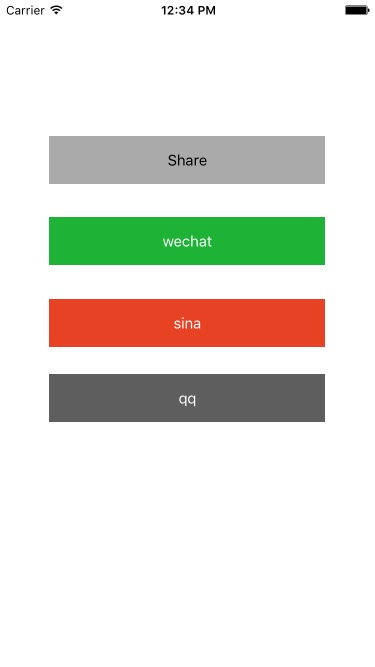

# CHSocialService
解耦第三方的快速分享和第三方授权登录的类库，目前版本基于UMengSocial5.0

#DEMO 演示
<p align="center">
  
</p>
#使用须知
将CHSocialService文件夹拖拽至工程中,import "CHSocialService.h"文件
info 配置参考和额外导入的framework 参照Demo工程
第三方授权需要拿到回调必须在AppDelegate文件中重写如下方法
```objc
- (BOOL)application:(UIApplication *)application openURL:(NSURL *)url sourceApplication:(NSString *)sourceApplication annotation:(id)annotation
{
    return  [CHSocialServiceCenter handleOpenURL:url delegate:nil];
}

- (void)applicationDidBecomeActive:(UIApplication *)application
{
    [CHSocialServiceCenter  applicationDidBecomeActive];
}
```

#Share
分享按钮，默认使用友盟的样式未支持自定义样式，根据配置的key显示分享的内容。
使用方法
```objc
    [[CHSocialServiceCenter shareInstance]shareTitle:@"测试分享标题" content:@"我是分享的内容123" imageURL:@"http://p2pguide.sudaotech.com/platform/image/1/20160318/3c896c87-65b6-481d-81ca-1b4a0b6d8dd4/" image:[UIImage imageNamed:@"demo_image"] urlResource:@"http://www.alibaba.com" controller:self completion:^(BOOL successful) {
        
    }];
```

#wechat 利用Type 进行第三方授权登录
使用方法，微信如下:
```objc
    [[CHSocialServiceCenter shareInstance]loginInAppliactionType:CHSocialWeChat controller:self completion:^(CHSocialResponseData *response) {
        
    }];
```
微博如下:
```objc
    [[CHSocialServiceCenter shareInstance]loginInAppliactionType:CHSocialSina controller:self completion:^(CHSocialResponseData *response) {
        
    }];
```
